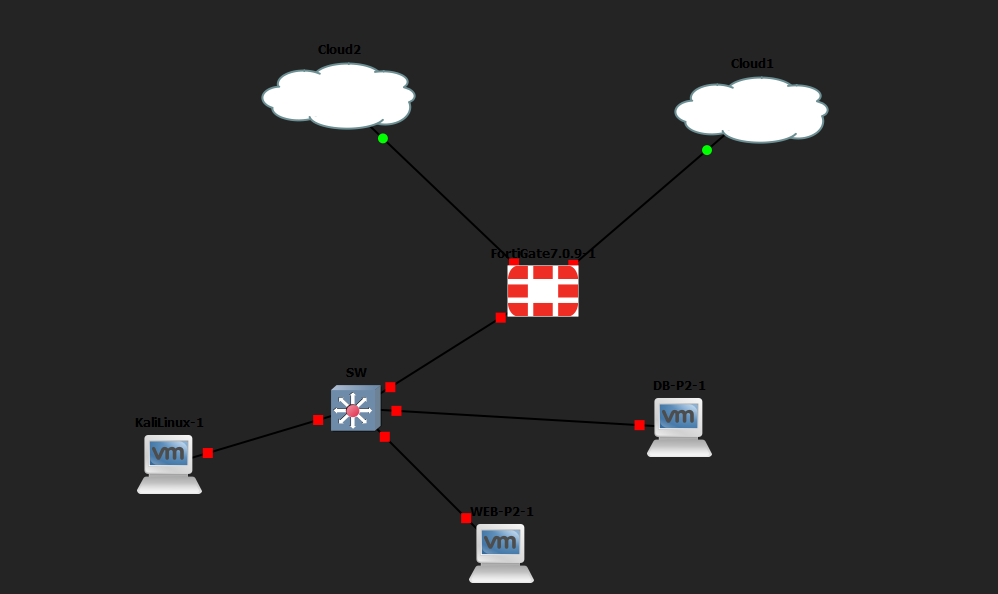
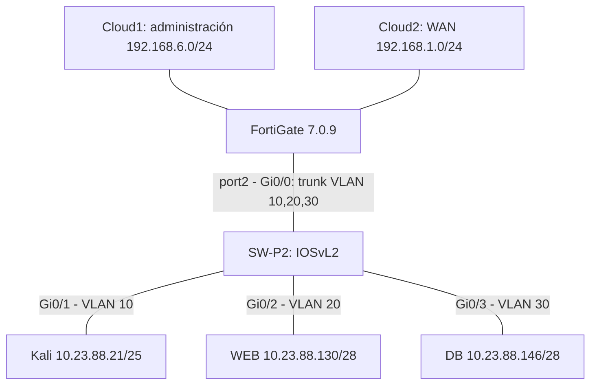
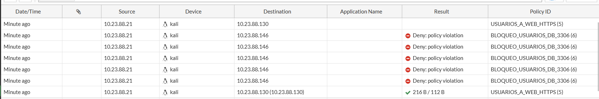
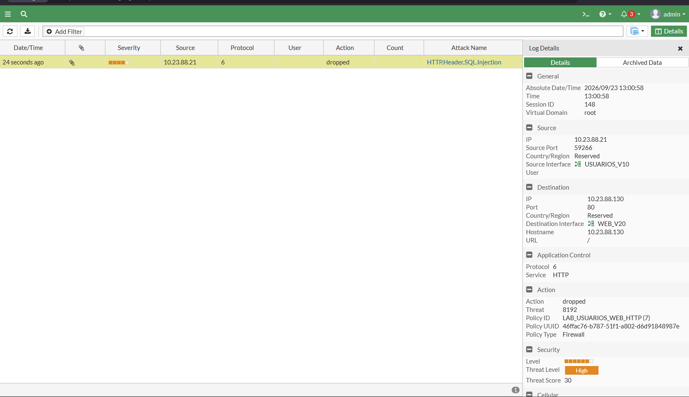
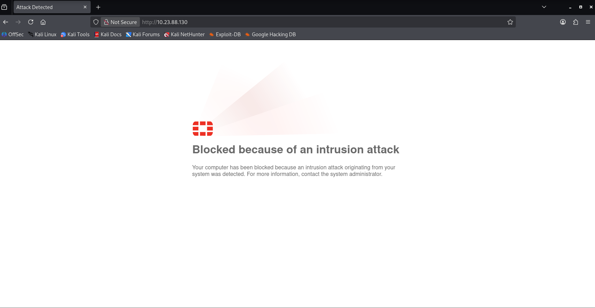
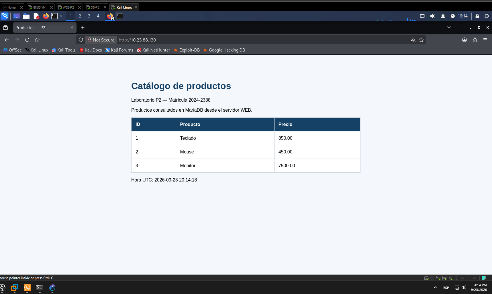
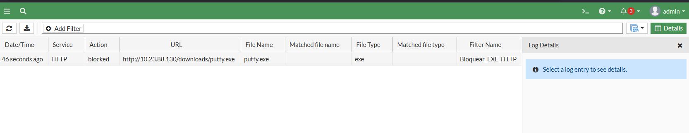
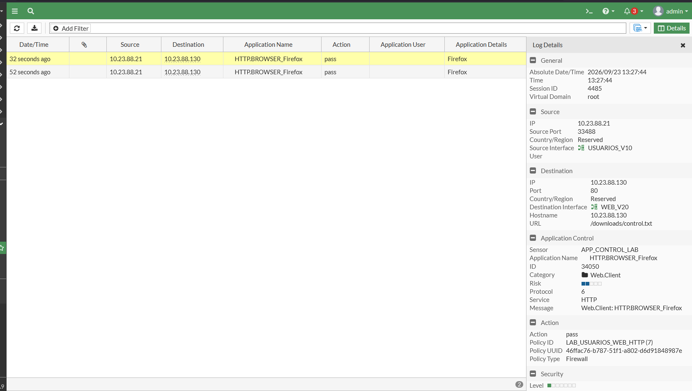
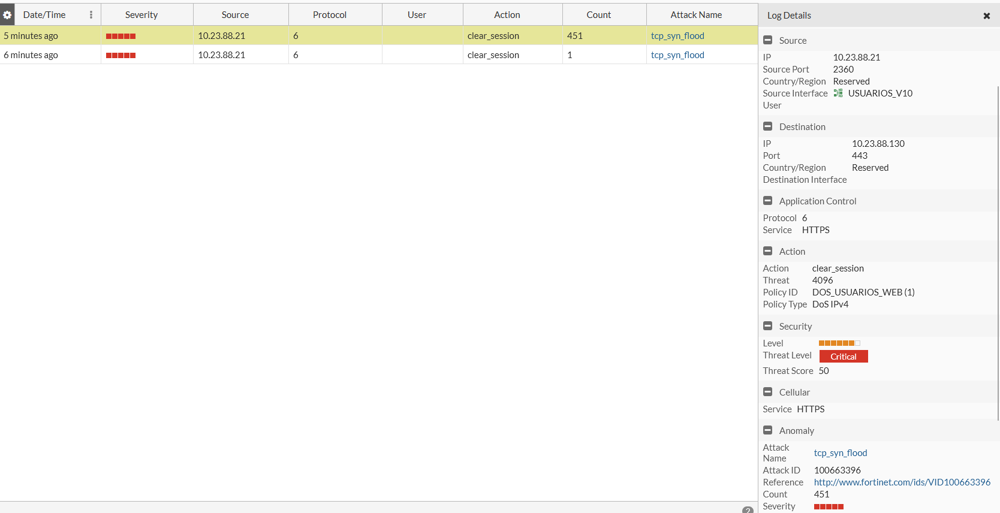

# Práctica P2 — Seguridad de redes con FortiGate

**Video demostrativo:** [Ver video en OneDrive institucional](https://itlaedudo-my.sharepoint.com/:v:/g/personal/20242388_itla_edu_do/IQAVCkpHLihMQZEYPwg9CifyAVpRR-jZB7LTc73zHVAEabw?nav=eyJyZWZlcnJhbEluZm8iOnsicmVmZXJyYWxBcHAiOiJPbmVEcml2ZUZvckJ1c2luZXNzIiwicmVmZXJyYWxBcHBQbGF0Zm9ybSI6IldlYiIsInJlZmVycmFsTW9kZSI6InZpZXciLCJyZWZlcnJhbFZpZXciOiJNeUZpbGVzTGlua0NvcHkifX0&e=VnRpvw)

**Estudiante:** Axel Enrique Vasquez Peña  
**Matrícula:** 2024-2388  
**Fecha de documentación:** 24 de septiembre de 2026  
**Entorno:** GNS3, VMware Workstation, FortiGate-VM KVM 7.0.9, IOSvL2, Ubuntu Server y Kali Linux.

## Propósito

Implementar una red segmentada para usuarios, servidor web y base de datos; controlar los accesos entre segmentos; publicar un catálogo por HTTPS y demostrar protección ante patrones SQL Injection, descargas de ejecutables y tráfico SYN de tasa elevada.

La documentación se basa en las configuraciones, salidas y capturas aportadas por el estudiante. No es una auditoría independiente de los equipos. Se incorporan archivos reales de WEB y DB, el running-config del switch y el respaldo final sanitizado de FortiGate. Las verificaciones finales de NAT y aislamiento se documentaron el 24/09/2026.

## Resultado y alcance

El catálogo HTTPS funciona y se observaron registros de denegación de usuarios a MariaDB, detección SQLi, cuarentena temporal, bloqueo de ejecutables y protección DoS. Application Control identificó Firefox en Monitor.

**Limitación principal:** IPS, cuarentena, File Filter y Application Control se probaron por **HTTP/80** mediante una política temporal. No se ha demostrado inspección profunda del contenido **HTTPS/443**. La importación de un certificado RSA de 2048 bits fue rechazada y se solicitó una evaluación completa a Fortinet. No se afirma cumplimiento total ni aceptación académica de la alternativa HTTP.

## Topología

Cloud1 conecta Windows a la administración por VMnet1. Cloud2 conecta la WAN a la red doméstica. FortiGate enruta entre VLAN por subinterfaces de port2. Los iconos de PC de las VM no cambian su función de servidores.

| Segmento | VLAN | Red / máscara | Gateway | Equipo |
|---|---:|---|---|---|
| Usuarios | 10 | 10.23.88.0/25 — 255.255.255.128 | 10.23.88.1 | Kali: 10.23.88.21 por DHCP |
| WEB | 20 | 10.23.88.128/28 — 255.255.255.240 | 10.23.88.129 | WEB-P2: 10.23.88.130 |
| DB | 30 | 10.23.88.144/28 — 255.255.255.240 | 10.23.88.145 | DB-P2: 10.23.88.146 |
| Administración | — | 192.168.6.0/24 | — | Windows .1; FortiGate port1 .131 |
| WAN doméstica | — | 192.168.1.0/24 | 192.168.1.1 | FortiGate port3 .7 por DHCP (verificación final) |

El esquema 10.23.88.x fue elegido a partir de la matrícula 2024-2388. Se usan dos subredes /28, una por servidor, para que su comunicación atraviese el firewall. Verificar las IP DHCP tras reiniciar.

### Diagrama lógico de conexiones

La captura de GNS3 muestra la disposición de los equipos; sus indicadores rojos no acreditan enlaces operativos. El trunk usa VLAN nativa 999 y permite únicamente VLAN 10, 20 y 30.

## Políticas relevantes

| Política | Flujo | Servicio | Acción / NAT |
|---|---|---|---|
| USUARIOS_A_WEB_HTTPS, ID 5 | Usuarios → SRV_WEB | TCP/443 | ACCEPT; sin NAT; no-inspection |
| BLOQUEO_USUARIOS_DB_3306, ID 6 | Usuarios → SRV_DB | TCP/3306 | DENY y registro |
| WEB_TO_DB_3306 | SRV_WEB → SRV_DB | TCP/3306 | ACCEPT; sin NAT |
| ADMIN_SSH_WEB / ADMIN_SSH_DB | PC_ADMIN → servidor correspondiente | TCP/22 | Administración; sin NAT |
| LAB_USUARIOS_WEB_HTTP, ID 7 | Usuarios → SRV_WEB | TCP/80 | ACCEPT; NAT habilitado; IPS, File Filter y Application Control |
| TEMP_WEB_UPDATES | WEB → WAN | DNS, HTTP, HTTPS | **Deshabilitada en el estado final**; NAT probado antes de desactivarla |

La WAN port3 recibe por DHCP 192.168.1.7/24 y gateway 192.168.1.1. En la GUI se verificó la opción de obtener gateway predeterminado y distancia 5. La salida a Internet y la traducción de origen se comprobaron en Forward Traffic: 10.23.88.130 → NAT 192.168.1.7, destino 172.66.147.243:80, sesión 266, política TEMP_WEB_UPDATES. Ver [verificación de NAT y aislamiento](verificacion-nat.md).

**Estado final de mínimo privilegio:** TEMP_WEB_UPDATES quedó deshabilitada y el respaldo final confirma `set status disable` para la política 3. Desde WEB, DB:3306 fue accesible, DB:22 y DB:80 no establecieron conexión, y la conexión a 172.66.147.243:80 terminó por timeout. El registro de la sesión 1390 confirmó WEB → DB:3306 por la política 4. Son pruebas de esos destinos y puertos concretos: un timeout por sí solo no identifica la causa ni demuestra el bloqueo de todos los puertos.

## Matriz de cumplimiento

| Requisito | Estado documentado |
|---|---|
| VLAN, usuarios DHCP /25 y servidores /28 | Configuraciones publicadas; VLAN y trunk corroborados con show vlan brief y show interfaces trunk |
| Seguridad básica del switch | Running-config publicado: sticky, restrict, PortFast, BPDU Guard y 12 puertos no usados en VLAN 999 apagados |
| WEB HTTPS y Usuarios/443 | Catálogo y conectividad observados |
| Usuarios → DB/3306 bloqueado | Log de denegación ID 6 |
| WEB → DB/3306 | Catálogo y consulta MariaDB reportada exitosa |
| WEB limitado a los flujos exigidos | Excepción WAN deshabilitada; pruebas negativas DB:22, DB:80 y destino WAN:80 documentadas |
| Ruta y NAT | Gateway DHCP revisado en GUI y NAT efectivo verificado en Forward Traffic |
| DPI sobre contenido HTTPS | **No completado; limitación declarada** |
| SQLi y cuarentena | Demostrados por HTTP |
| Bloqueo .exe | Demostrado por HTTP con File Filter |
| Application Control | Firefox identificado en Monitor; no bloquea .exe en la evidencia |
| Protección DoS | tcp_syn_flood, clear_session hacia WEB:443 |
| GitHub, video y TXT | Repositorio público creado; video enlazado al inicio y TXT de entrega preparado |

## Evidencias seleccionadas

### Segmentación

### IPS por HTTP

### Cuarentena y recuperación

### File Filter

### Application Control

### Protección DoS

## Documentación

- [Implementación](implementacion.md).
- [Pruebas y resultados](pruebas.md).
- [Limitación HTTPS](limitaciones.md).
- [Inventario de evidencias](evidencias.md).
- [Estado de las configuraciones y pendientes](configuraciones-pendientes.md).
- [Comandos de pruebas](pruebas-manuales.md).

## Conclusión

Las pruebas documentan controles efectivos en los flujos ensayados. La protección del contenido HTTPS permanece sin validar y los resultados HTTP se presentan como evidencia parcial. Las exportaciones sanitizadas están publicadas. El video está enlazado al inicio del repositorio y el TXT de entrega contiene los enlaces del repositorio y del video. No se presenta la inspección profunda HTTPS como completada.

## Archivos reales del servidor WEB

- [Aplicación PHP](index.php).
- [Nginx HTTPS](nginx-p2.conf).
- [Nginx HTTP de pruebas](nginx-p2-http-lab.conf).
- [Red del servidor WEB](web-netplan.yaml).

Copiados del servidor y revisados el 24/09/2026. Las credenciales externas de la base de datos y la clave privada TLS no se publican.

## Archivos reales del servidor DB

- [Red del servidor DB](db-netplan.yaml).
- [Configuración base de MariaDB](mariadb-50-server.cnf).
- [Configuración del laboratorio MariaDB](mariadb-60-p2.cnf): establece escucha en 10.23.88.146 y prevalece sobre el archivo base.
- [Exportación SQL de productos](productos.sql): estructura y datos actuales del catálogo; no es el script original de creación ni contiene cuentas o contraseñas. Su restauración reemplaza la tabla de productos.

## Configuraciones de red y verificaciones finales

- [Running-config del switch](switch-running-config.txt).
- [Respaldo final sanitizado de FortiGate](fortigate-sanitizado.conf).
- [Prueba de NAT y aislamiento final](verificacion-nat.md).
- [Comandos de pruebas manuales](pruebas-manuales.md).

El respaldo de FortiGate se exportó desde la GUI después de deshabilitar TEMP_WEB_UPDATES. Se retiraron credenciales y material criptográfico: la copia pública sirve como documentación y no como respaldo íntegro restaurable. La configuración y demostración de FortiGate se realizaron por GUI.
